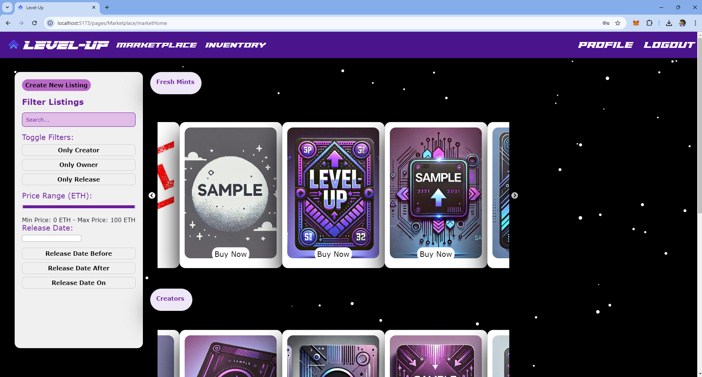

# The <span style="font-family:'PaladinsLaser';">Level-Up </span> Project

[](https://discord.gg/f6kwhSEp)  [](mailto:npastrana15@outlook.com)

## Project Abstract
Level-Up is a open-source web3 project, conceived from winning 🏆 the EthMiami Challenge at FIU ShellHacks 2024, focused on building a next-gen NFT Marketplace. Level-Up NFTs can be "Leveled-Up" through physical or digital engagement with your favorite creators, events, brands, and companies. The higher level your NFT is, the better your chances will be for perks and rewards across physical and digital realities. Read our Mission Doc here:  [Mission Statement](https://docs.google.com/document/d/1lNKjT-8U095Y8X2VzrIardgacW-AdabSoBK0094m62Q/edit?usp=drive_link)



Interested in getting involved? Join the Discord!

Interested in contributing? Send us an email! 

## Installation / Setup

1. Open, Install, & Start the Backend:
   ```bash
   cd api
   go mod tidy
   go run main.go
   ```

2. Open, Install, & Start the Frontend:
   ```bash
   cd app
   npm install
   npm run dev
   ```

3. Run Smart Contract Deployment Scripts
   ```base
   deploy
   ```

4. Start Hardhat Server (Sepolia Testnet)
   ```bash
   cd api/hardhat
   ```

Currently, we are just building to the Ethereum blockchain, planning to do Solana next. Currently testing on Sepolia Testnet, we write our smart contracts in Solidity. Our backend is in Go, using the Fiber web framework. Our database is PostgreSQL, our core dev team likes to use pgadmin for a local development gui manager. Our Frontend is TypeScript on a Vite webserver running React Web + Native via Tamagui components! 

At the moment, we are using Azure Storage for file/image storage but we are exploring more contemporary solutions i.e. ipfs and/or FileCoin. Yes, those azure storage credentials are out-dated, we left them there as placeholders, update with your own credentials for local development.

** *If you're going to contribute, remember to optimize ui layout for web and mobile!* **

---
## Project Directory Outline
### api
- **database/**
  - ***accountdatabase/***

    `accountdatabase.go`
  - ***nftdatabase/***
    
    `nftdatabase.go`
- **handlers/**
  - `account.go`
  - `marketplace.go`
- **hardhat/**
- **middlewares/**
  - `auth.go`
- **utils/**
  - `email_verification.go`
  - `jwt_util.go`
  - `send_email.go`
- `main.go`
- `go.mod`
- `go.sum`

## app/src/
- **assets/**
- **pages/**
  - **Home/**
    - `freshMint.tsx`
    - `home.tsx`
    - `TamaguiCarousel.tsx`
    - `upcoming.tsx`
  - **Marketplace/**
    - `createNewListing.tsx`
    - `marketHome.tsx`
    - `MarketListing.tsx`
  - **Profile/**
    - `creatorapp.tsx`
    - `forgotpassword.tsx`
    - `kyc.tsx`
    - `kycreview.tsx`
    - `login.tsx`
    - `logout.tsx`
    - `profile.tsx`
    - `releaseform.tsx`
    - `resetpassword.tsx`
    - `reviewreleaserequest.tsx`
    - `signUp.tsx`
    - `transactions.tsx`
  - **Staking/**
    - `levelup.tsx`
    - `rent.tsx`
- `App.tsx`
- `ErrorBoundary.tsx`
- `ParticlesBackground.tsx`
- `Navbar.tsx`

---

## Config Files
- `.gitignore`
- `package.json`
- **TypeScript Configs:**
  - `tsconfig.app.json`
  - `tsconfig.json`
  - `tsconfig.node.json`
- **Vite Config:**
  - `vite.config.ts`


<style>
@font-face {
    font-family: 'PaladinsLaser';
    src: url('./app/public/fonts/PaladinsLaser.woff2') format('truetype');
}
</style>
